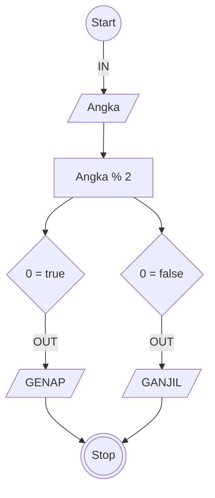

# Algoritma

## Menentukan bilangan ganjil 

## Deskriptif

Algoritma yang ditulis untuk menentukan suatu bilangan merupakan ganjil atau genap

1. Mulai
2. Ambil nilai bilangan
3. bagi nilai bilangan tersebut dengan 2
4. jika hasilnya angka bulat maka difinisikan bilangan tersebut adalah genap
5. jika hasilnya merupakan angka desimal maka tentukan bilangan tersebut adalah ganjil
6. selesai

## Flowchart

