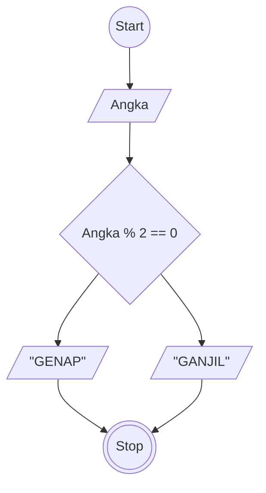

# Algoritma

## Menentukan bilangan ganjil 

## Deskriptif

Algoritma yang ditulis untuk menentukan suatu bilangan merupakan ganjil atau genap

1. Mulai
2. Input Angka
3. Modulus Angka dengan 2 
4. Jika hasilnya sama dengan 0 outputkan GENAP
5. Jika hasilnya tidak sama dengan 0 outpukan GANJIL
6. selesai


## Flowchart



## Pseudo_code

```pseudo
DECLARE Angka: INTEGER

INPUT Angka

IF Angka % 2 == 0 THAN
    OUTPUT "BULAT"
ELSE
    OUTPUT "GANJIL"
ENDIF

```