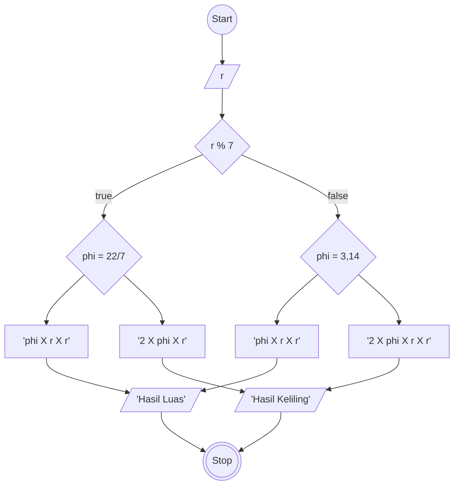

# Algoritma
## Menghitung Luas dan Keliling Lingkaran

Algoritma yang ditulis untuk menyelesaikan masalah menghitung luas lingkaran dan keliling lingkaran

## Deskriptif

1. Mulai
2. Masukan panjang jari-jari (r)
3. kalikan r pangkat 2 dengan pi yang bernilai 3,14 atau 22/7  
4. Munculkan hasilnya sebagai luas
5. lanjut
6. kalikan r dengan pi yang bernilai 3,14 atau 22/7 lalu dikalikan kembali dengan 2
7. munculkan hasilnya sebagai keliling
8. selesai
A --> B
B --> C
C --> L
L --> H
H --true--> D
H --false--> E
H --true--> G
H --false--> F
G --> J
F --> J
D --> I
E --> I
J --> K
I --> K

## Flowchart

