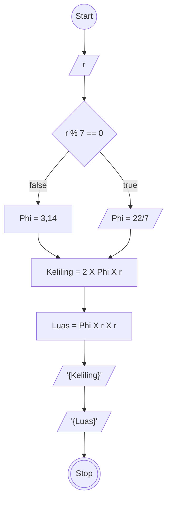

# Algoritma
## Menghitung Luas dan Keliling Lingkaran

Algoritma yang ditulis untuk menyelesaikan masalah menghitung luas lingkaran dan keliling lingkaran

## Deskriptif

1. Mulai
2. Input nilai jari-jari (r)
3. Phi bernilai 3,14 atau 22/7
3. kalikan r kuadrat dengan phi   
4. Outputkan sebagai Luas
5. lanjut
6. kalikan r dengan Phi kali 2
7. Outputkan sebagai Keliling
8. selesai


## Flowchart



## Pseudo-Code
```pseudo
DECLARE r: INTEGER
DECLARE Phi: DOUBLE
DECLARE Keliling: INTEGER
DECLARE Luas: INTEGER

INPUT r

IF r % 7 == 0 THAN
    OUTPUT Phi: 22/7
ELSE
    OUTPUT Phi: 3,14
ENDIF

Keliling <- 2*Phi*r
Luas <- Phi*r*r

OUTPUT Keliling
OUTPUT Luas
```