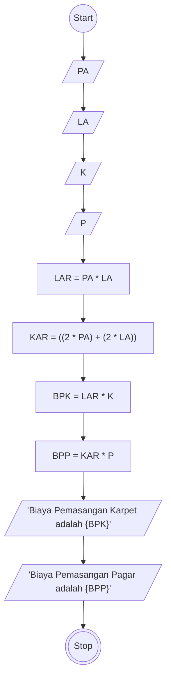

# Algoritma

## Menghitung luas Persegi Panjang

## Deskriptif

Algoritma ini bertujuan untuk menghitung Luas Persegi Panjang dan keliling persegi panjang untuk

1. Start
2. Input Panjang Area (PA)
3. Input Lebar Area (LA)
4. Input Harga Karpet/M2 (K) 
5. Input Harga Pagar/M (P) 
6. Luas Area (LAR) sama dengan PA dikali LA
7. Keliling Area (KAR) sama dengan 2 kali PA ditambah 2 Kali La
8. Outputkan Biaya Pemasangan Karpet (BPK) adalah dari hasil LAR dikali K
9. Outputkan Biaya Pemasangan Pagar (BPP) adalah hasil dari KAR dikali P
10. Stop

## FlowChart


## Pseude-Code
```pseude
TYPE i = ^INTEGER
DECLARE PA: i
DECLARE LA: i
DECLARE K: i
DECLARE P: i
DECLARE LAR: i
DECLARE KAR: i
DECLARE BPK: i
DECLARE BPP: i

INPUT PA
INPUT LA
INPUT K
INPUT P

LAR <- PA * LA
KAR <- ((2*PA)+(2*LA))
BPK <- LAR * P
BPP <- KAR * P

OUTPUT "Biaya Pemasangan Karpet adalah", BPK
OUTPUT "Biaya Pemasangan Pagar adalah", BPP
```