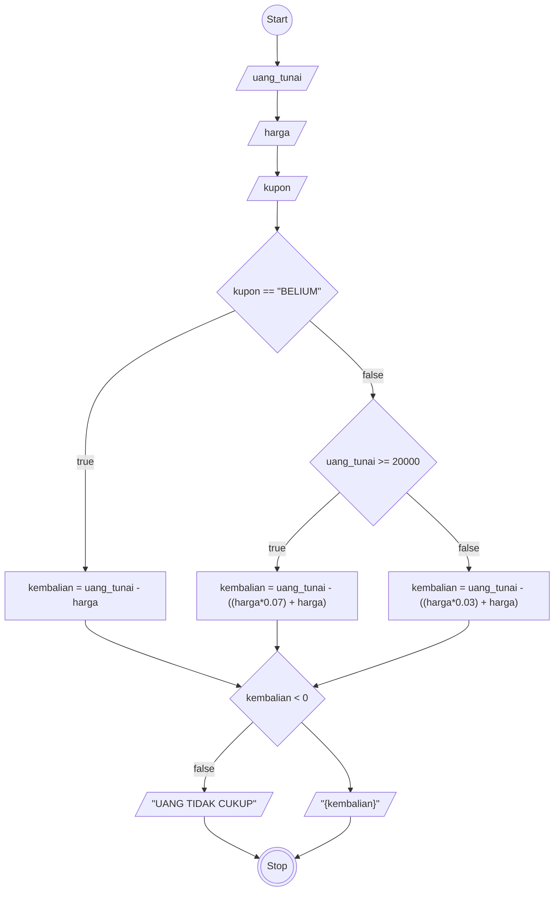

# ALGORITMA

## MENGHITUNG KEMBALIAN BERDASARKAN KUPON

Algoritma ini untuk menyelesaikan masalah Menghitung kembalian berdasarkan kupon

## DESKRIPTIF

1. Start
2. Input uang_tanai 
3. Input harga 
4. Input kupon
3. Cek kupon, jika sesuai yang di izinkan yaitu BELIUM outputkan kembalian dari perhitungan uang_tunai dikurang harga
4. Jika tidak sesuai, cek uang_tunai, jika sama dengan atau lebih besar dari 200.000 maka outputkan kembalian dari perhitungan uang_tunai dikurang harga ditambah 7% dari harga
5. Jika tidak sama, outputkan kembalian dari perhitungan uang_tunai dikurang harga ditambah 3% dari harga
6. Cek kembalian, jika value kurang dari 0, outputkan UANG TIDAK CUKUP
7. Jika tidak, outputkan kembalian
8. Stop 

## FlowChart

## Pseude-Code

@{ shape: lean-r, label: '"{kembalian}"' }

```pseude

TYPE i = ^INTEGER

DECLARE uang_tunai : i
DECLARE harga : i
DECLARE kembalian : i
DECLARE kupon: STRING

INPUT UPPERCASE(kupon)
INPUT uang_tunai
INPUT harga
INPUT kupon

IF kupon == "BELIUM" THAN
    kembalian <- uang_tunai - harga
ELSE
    IF uang_tunai >= 20000 THAN
        kembalian <- uang_tunai - ((harga*0.07) + harga)
    ELSE 
        kembalian <- uang_tunai - ((harga*0.03) + harga)
    ENDIF
ENDIF

IF kembalian < 0 THAN
    OUTPUT "UANG TIDAK CUKUP"
ELSE
    OUTPUT kembalian
ENDIF

```